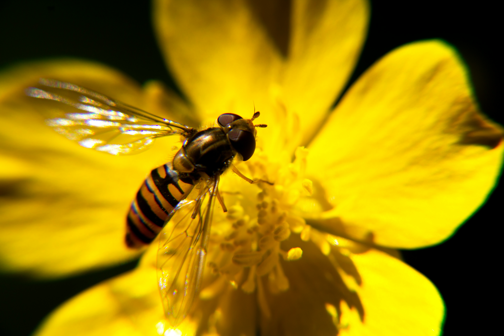

The NBA is a key reference and educational work for use by academics, scientists, students, non-profit organisations and funders. When asked ‘What are the main ways that you used information from the NBA 2018?’, survey respondents ticked the options ‘In presentations about biodiversity (general awareness)’, ‘As part of teaching / education / training’, and ‘To provide an overall biodiversity profile of South Africa’ – illustrating how important the NBA is as a resource for general awareness and education.
