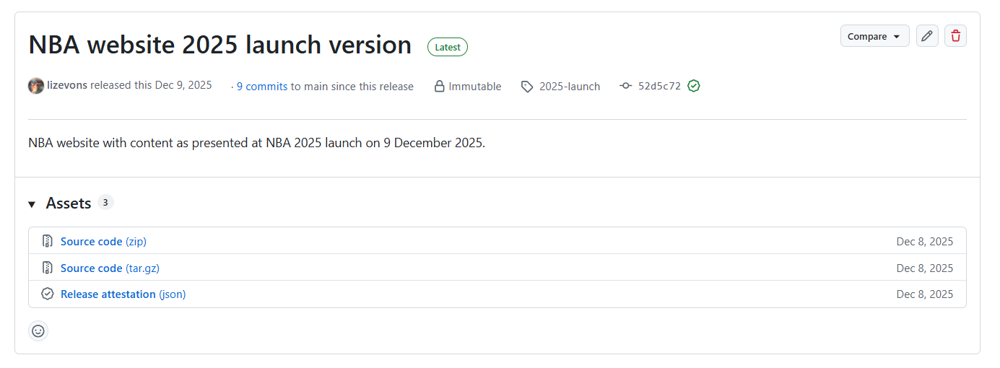

With the NBA going online in 2025, it is now possible to update content, without needing to wait until the next national assessment is due. This means that:

-   Small errors can be corrected almost immediately

-   New data and updated assessments can be published as they become available

-   New content can be added

## Managing the production of new and updated content

### While work is in progress

The NBA website draws from the **main branches** of the content repositories. Every time the website is updated, the latest version of **all** the content repositories are extracted, and added to the new website version. To avoid work in progress ending up on the live NBA website, **all work in progress must be done on feature branches**. Only merge your new content to your main branch when it is ready for publication.

### When updated content is ready for publication

#### Small corrections

If changes are relatively small - fixing of typos and other corrections to content, then nothing further needs to be done.

#### Major content updates

If you make substantial changes to your content such as updating an indicator assessment, adding a new indicator (e.g. for a new taxon group or realm) or publishing a new version of a map, this needs to be appropriately documented as a new content version.

1.  Input data, code, and outputs need to be assigned a new version tag

2.  The content page(s)' publication date must be updated

3.  An announcement must be made in the What's new section of the NBA website

#### New content

All instructions for major content updates apply here as well, with the following addition: if your new content requires changes to the NBA website navigation (the contents bar on the left side of content pages), such as a new page needs to be inserted, then also [post an issue on the nba-website repo](https://github.com/SANBI-NBA/nba-website/issues) with clear instructions on how the navigation section needs to be amended.

## Importance of version management

NBA headline indicators, as well as output data such as maps of threatened ecosystems, feed into various national reporting processes, such as the national State of the Environment Report produced by DFFE, South Africa's country report to the Convention on Biological Diversity, and South Africa's progress towards UN Sustainable Development Goals. For these reports, the specific data and assessment that are cited in these reports need to be traceable to maintain credibility. In the past, the NBA publication was the "one source of truth" for our data and assessments, but with a website where content updates are possible at any time, this one source of truth becomes more challenging to maintain.

Within these reporting obligations it becomes ever more important that we keep track of the following:

-   input datasets - which protected area map version, version of the national integrated ecosystem map or which version of the national plant Red List of Species Status were used in your assessment

-   version of the code that was used to run the analysis - which exact commit was used to produce a specific indicator assessment output

-   assessment outputs that are dated and correctly attributed to its input datasets and code versions

### When should data, code and outputs be versioned

Each time you assess an NBA indicator - either for the first time, or with the intention to update existing NBA content you should version your assessment. This assessment can be triggered by either new input data, such as updated ecosystem maps or species' Red List assessments, or in instances where you have detected errors in your code and you have corrected them. In other words, each time you run an indicator analysis that produces different outputs than what you had before, you need to version that assessment. Assessment versioning need to be recorded as part of assessment metadata when indicators are submitted for the national indicator database, so it is a good idea to implement a system where you do this as part of your assessment process.

### Code releases as immutable methodological snapshots

GitHub provides the functionality to archive a particular commit of your analytical code as a [release](https://docs.github.com/en/repositories/releasing-projects-on-github/about-releases). This tags that specific commit as a release and stores a zipped version of the code as it was at that point in time under the Releases section of your repo. This sits separately from your commit history and so will not be influenced by code rollbacks or branch rebases, which can wipe commit histories out. A release can never be changed, only deleted. Within GitHub, there is also functionality to compare code between releases, so that interested users can see exactly what changed since your last assessment.

**It is recommended that you create a release each time you publish a new version of an indicator assessment.**

{fig-align="center"}

#### How to create a code release

1.  It is recommended that you set up [immutable releases](https://docs.github.com/en/code-security/concepts/supply-chain-security/immutable-releases) - these kinds of releases can never be changed after publication, maintaining the integrity of indicator assessment provenance.

    a.  On the main page of your repository, go to settings

    b.  Scroll to the Releases section, and select **Enable release immutability**

2.  See the [GitHub instructions for how to create a new release](https://docs.github.com/en/repositories/releasing-projects-on-github/managing-releases-in-a-repository#creating-a-release)

3.  You can decide what system to use for numbering your releases (release tags) but it is recommended that you include the publication date, e.g. assessment-2025-12-08

4.  If you follow the GitHub instructions above, it will create a release from the latest commit of the branch you selected. If you want to create a retrospective release, you need to find the commit number (hash) of the commit you want to release in your commit history. Then under Target, paste the commit number into the Target search bar.

::: {.callout-important icon="false"}
## Important

It is recommended that under the Technical Documentation section of your content page, you link to the release that was used to inform the content, rather than just the main code repository. You link to the release by clicking on the release in the sidebar of your repository, and then copying the link from GitHub, which will be something like this:

github.com/SANBI-NBA/\[your repository name\]/releases/tag/\[the name of your tag\]
:::

### Linking input data and assessment outputs to code releases

The code used to compute an indicator assessment is not reproducible unless the exact input data that was used is maintained alongside the code. Most of the time, new assessments will be triggered by new data versions. Therefore it is important that the input data used in past assessments are not replaced when new assessments are done, but maintained as separate, immutable data files.

Secondly, input data from each assessment need to be stored in a secure space. Most of the time, it is not possible to store input data directly in code repositories (in which case the input data will be preserved alongside the code in the release), because data files typically exceed GitHub's 100 MB file size limit. Input data snapshots that are too large to be accommodated inside Git repositories therefore need to be stored in separate data repositories, but it must still be possible to trace the exact data snapshot that was used in the assessment.

#### What is a data repository

A data repository is a digital space where data can be securely stored long-term, without the risk of loss, theft or data corruption. Data repositories can be privately maintained (e.g. Dropbox, Google Drive) or institutionally provided (e.g. SANBI NBA OneDrive, FigShare), and can be public or private, depending on data sensitivity. They are typically cloud-based, so that they are less vulnerable to loss of storage devices or hard drive crashes.

Some systems, especially those specifically designed as archival repositories, can automatically track data file versions, but if your chosen data repository does not provide such functionality, you need to implement a more manual approach to managing data file versions. This can be including the assessment release tag in the file name, or creating a folder for each assessment with the release tag in the folder name. The latter option may be preferable as it does not require code adjustments for reading in data files for each assessment. Instead, you only need to point the code to the correct data folder (e.g. in an [.Renviron file](https://docs.posit.co/ide/user/ide/guide/environments/r/managing-r.html#renviron).

#### Managing assessment outputs

If your assessment outputs any data products, for example a map or a spreadsheet of computed indicator values, and these are stored separately from your analytical code repository - for example in your content repository because it supports the creation of a figure or table on your content page, then it may be necessary to either tag these files with the same assessment release tag as well (if they are in a different repository), or make sure that they are stored in your data repository alongside your input data snapshots.

#### Bringing it all together with an assessment.yml

YAML files are very useful tools for capturing metadata that is both human and machine-readable (making it easier to import into a relational database). You have already been introduced to YAML through YAML headers in your Quarto files, and if you have built your own Quarto projects, you may have worked with a project file such as `_quarto.yml`.

It is highly recommended that you accompany each assessment release with a custom yml file that helps you to keep track of where your related input and output files are. This yml file is included in your analytical repository and updated each time you do a new assessment, before you create your new code release.

A template for an assessment metadata YAML file is included in this best practice section:

[assessment.yml template](assessment.yml)

### Maintaining code reproducibility with renv

Our R code is dependent on packages that are maintained by independent institutions and developers, and over time, packages change, dependencies are deprecated, and other updates are implemented which can lead to R code no longer functioning when you try to run it on newer installations of operating systems, R versions, or even newer versions of RStudio. The [renv package](https://rstudio.github.io/renv/articles/renv.html) helps you to create reproducible environments for R projects that can help sustain the functionality of R code. It also enables collaboration by allowing collaborators to replicate the exact R environment on different computers.

#### Setting up renv

1.  Make sure renv package is installed `install.packages("renv")`.

2.  Initialise renv by typing `renv::init()` in the R console. This creates several additional files and folders within your project for tracking packages and versions used in your project. Do not commit everything to your repository - the important files are `renv.lock`, `.Rprofile`, `renv/settings.json` and `renv/activate.R`. Luckily renv automatically creates a handy .gitignore file within the renv folder to make sure that only these files are committed.

3.  Once your coding is done and you have a good idea which packages you will be using, run `renv::snapshot()`. This records all the packages and versions in use in the project in the library folder. renv is set up to configure the project according to the information in the renv.lock file every time you start up the project. If you don't want it to apply this environment, you can turn renv off with `renv::deactivate()`.

#### Configuring a renv environment on a different computer

1.  Clone or pull the relevant repository.
2.  Make sure renv is installed.
3.  Run `renv::activate()`, then `renv::restore()`. This initiates a long process where it goes and fetches the exact version of all the packages it can find as listed in the lock file and creates a package library for the project. If there are some packages where it can’t find the exact version it will ask if it can install the latest version of the package – saying yes seems to work fine here. Then it comes up with a list of packages it can’t install, including nbaR. With renv activated, install nbaR as usual - `devtools::install_github("SANBI-NBA/nbaR")`.

::: callout-tip
Using renv creates package libraries for each project, which can cause a lot of duplication if you use the same packages in most of your projects. A way around this is to use `renv::install()` instead of `install.packages()`. renv's own install checks if the package already exists somewhere and creates a link to the global cache, rather than re-downloading and installing multiple copies. Read more at the [renv vignette](https://rstudio.github.io/renv/articles/renv.html#infrastructure).
:::

### Steps to follow when updating content

::: callout-note
Note these steps assume you are starting from a correctly documented and archived code repository. If this is your first time, start at step 5.
:::

#### In your computational repository[^1]

[^1]: In other words, the analytical respository where your code for computing the indicator is stored.

1.  Gather new versions of your input datasets, add them to your preferred data respository. Do not replace/overwrite any of the input files of your previous assessment - these should always be maintained as immutable files.

2.  If you need to make substantial changes to your computation method, create a feature branch and merge back to your main branch once code has been tested. Remember to capture a new method version on your assessment.yml file.

3.  If necessary, edit your `.Renviron` file to read input data from the latest versions.

4.  Test and run the assessment, review ("sense check") outputs, repeat if necessary, until all coding issues are resolved. If necessary, merge code on feature branch back to main.

5.  Run `renv::snapshot()` to record input package versions. If it is your first time using renv, set it up following the instructions above.

6.  Create or update `assessment.yml` - decide on what your release tag will be and add it to this file.

7.  Commit and push new versions of `renv.lock` and `assessment.yml`

8.  Create a new release tag for the repository.

#### In your content repository[^2]

[^2]: This is the repository where you create quarto files that become part of NBA website pages

9.  Create a feature branch to update your content

10. Update content on content page:

    1.  Update publication date in yaml header

    2.  Update your technical documentation section to link to the correct code release

11. Review content, test that rendering is working correctly

12. Merge back to main branch

#### Request that a NBA website update is scheduled

13. Post an issue on nba-website repo requesting a page update:

    1.  Include a short description of what the update is about that can be posted on the [What's new page](https://nba.sanbi.org.za/content/context/whatsnew-nba.html)

    2.  Provide a relevant picture.

    3.  If it is necessary to insert a new entry in the content sidebar, provide an explanation of where the new page should go.
